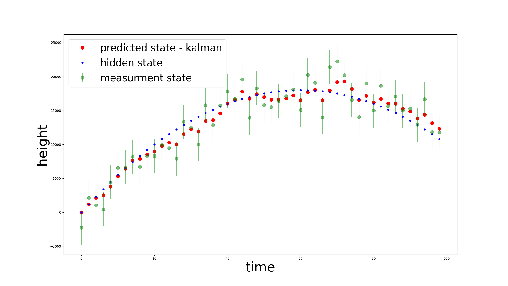
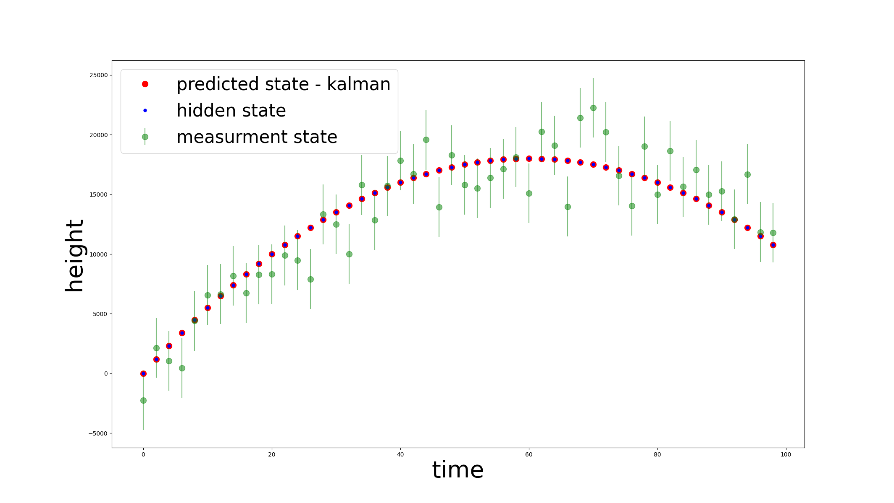
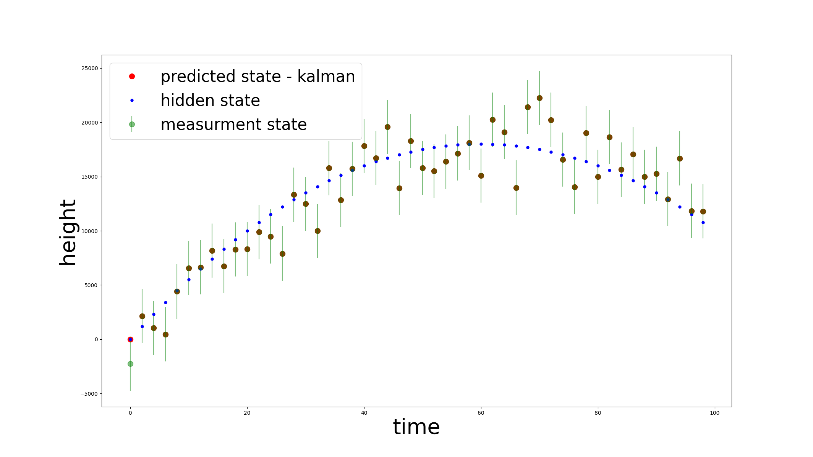

# Kalman for ballistic trajectory
Python implementation of the kalman filter for ballistic trajectory  - **kalman_ballistic_trajectory.py**

**30.11.2022**  
**Dominika Świtlik** 

### Reguirements:
*python3, numpy, matplotlib*  

### Run:

```console
./kalman_ballistic_trajectory.py
```


### Program description
Script is a simple implementation of **Kalman Filter** for a problem of a ballistic trajectory. 
The implementation is based on the article **http://www.cs.unc.edu/~welch/media/pdf/kalman_intro.pdf** 

**class** Parameters() 
* contains initial values and models parameters
**function** generate_measurment() - 
* takes an object of the Parameters class
* return measurement with gaussian noise.
**class** Model() 
* takes an object of the Parameters class
* contains prediction model, measurement model and its errors
**class** Kalman()
* takes an object of the Parameters class and Model class
* is implementation of Kalman filter
**function** start()
* runs Kalman filter through time space, collects predicted states
* plots results


#### Basic test

if error of the prediction and measurement exists Kalman filter will return weighted average between measurement and prediction

if prediction error is zero (uncomment line 68) measurement is ignored

if measurement error is zero (uncomment line 70) prediction is ignored


#### Libraries:

Python3    
NumPy  
matplotlib  

